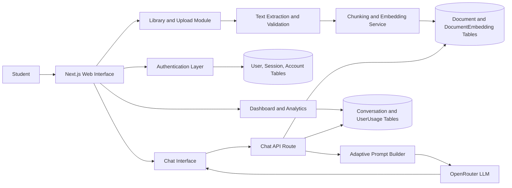
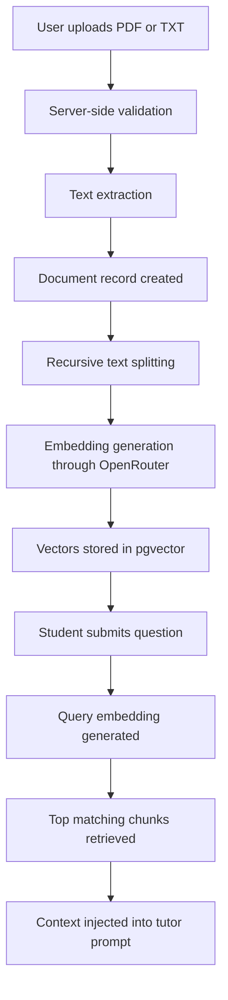

CHAPTER THREE
SYSTEM ANALYSIS AND DESIGN

3.1 PROPOSED SYSTEM OVERVIEW

The system developed in this study was an AI-powered personalized learning assistant designed to support students with curriculum-grounded tutoring, material ingestion, and adaptive conversational assistance. The platform was implemented as a web-based tutoring environment in which authenticated users could upload course materials, build a personal knowledge base, interact with an AI tutor, and review their learning activity through a dashboard. The overall design responded to the long-standing Intelligent Tutoring System (ITS) principle that effective digital tutoring environments should combine a user interface, a domain knowledge source, tutoring logic, and a learner model into a coordinated structure (Alkhatlan and Kalita, 2018).

The proposed system was deliberately designed around controlled personalization rather than unrestricted open-domain generation. This design choice was informed by recent studies showing that personalized AI tutoring becomes more useful when responses are tied to contextual educational materials and pedagogical constraints rather than generic language generation alone (Wang et al., 2024; El Hajji et al., 2025). It was also guided by concerns in the literature that poorly bounded AI tutors may create misplaced trust, over-automation, or misleading confidence in learners if the system does not clearly communicate what it knows and what it does not know (Qadir and Mumtaz, 2025).

Accordingly, the implemented platform was structured around five core subsystems:

Table 3.1: Core subsystems of the proposed learning assistant

| Subsystem | Main role in the system | Implemented elements |
| --- | --- | --- |
| Authentication and access control | Protect user data and enforce private learning sessions | Better Auth, protected routes, session-aware middleware |
| Curriculum ingestion pipeline | Accept and process uploaded learning materials | PDF/TXT upload, text extraction, chunking, embedding generation |
| Knowledge retrieval layer | Retrieve relevant curriculum context for each user query | pgvector similarity search over document embeddings |
| Adaptive tutoring engine | Generate responses grounded in retrieved context and learner settings | OpenRouter-backed chat route, Socratic mode, strict curriculum mode, experience-based prompt adaptation |
| Learning management interface | Support interaction, document management, and activity review | Dashboard, library, analytics, chat interface, settings page |

The system also reflected the educational motivation behind scalable AI tutoring. LearnLM Team (2025) reported that AI-supported tutoring can improve immediate student problem-solving outcomes under structured instructional conditions, while Wang et al. (2024) showed that human-AI tutoring support can strengthen guidance quality in real-time instructional settings. Based on these findings, the present study adopted a system architecture that emphasized guided tutoring, transparent curriculum grounding, and reusable learning records rather than a general-purpose chatbot.

3.2 SYSTEM ARCHITECTURE

The architecture of the proposed system followed a layered web application model implemented with Next.js App Router, TypeScript, Tailwind CSS, Neon PostgreSQL, Prisma ORM, Better Auth, OpenRouter, and the Vercel AI SDK. Figure 3.1 presents the high-level arrangement of the major components.

Figure 3.1: High-level architecture of the AI-powered personalized learning assistant

As shown in Figure 3.1, the frontend layer handled user interaction through route-based pages for login, dashboard access, document management, analytics, settings, and AI chat. The middleware layer enforced route protection by redirecting unauthenticated users away from protected learning pages. The application server layer hosted the upload action, the chat API route, and the supporting services for knowledge retrieval, usage tracking, and session handling. The data layer stored user records, documents, vector embeddings, conversations, and usage counters in PostgreSQL.

The architecture also adapted established ITS ideas into a modern LLM-based design. The interface model was implemented through the dashboard and chat screens, the domain model was represented by user-uploaded curriculum documents and their embeddings, the tutoring model was operationalized through the prompt rules and response settings, and the learner model was simplified into usage counts and stored preferences. This mapped classical ITS structure into a practical web deployment that could be implemented within the project scope (Alkhatlan and Kalita, 2018).

To reduce hallucination risk, the chat route retrieved relevant material before text generation and inserted the returned evidence directly into the system prompt. This design corresponded with the emphasis in recent educational AI systems on context-grounded tutoring and transparent instructional support (El Hajji et al., 2025). The architecture also required that retrieved context be scoped to the current authenticated user, thereby preventing document leakage between users and preserving data separation.

3.3 KNOWLEDGE INGESTION AND RETRIEVAL MODULE

The knowledge ingestion module was designed to transform raw curriculum materials into a searchable semantic knowledge base. Users submitted PDF or plain text files through the library interface. On the server side, each upload was first validated for type and file size, with a maximum file size of 10 MB. PDF content was parsed into raw text, while text files were ingested directly. The extracted text was then stored in the document table and passed to the vectorization pipeline.

The vectorization workflow is summarized in Figure 3.2.

Figure 3.2: Curriculum ingestion and retrieval workflow

The chunking stage used recursive character splitting with a chunk size of 1000 characters and an overlap of 200 characters. This approach preserved continuity between adjacent segments and reduced the risk that conceptually related passages would be separated too aggressively. The design choice aligned with the requirement that educational support systems should retain sufficient explanatory context to support coherent tutoring rather than isolated sentence retrieval.

After chunking, embeddings were generated in batches using an OpenRouter-compatible embedding endpoint. Each vector was then inserted into PostgreSQL using raw SQL because the embedding column was defined as a `vector(2048)` type, which required explicit handling through pgvector. During query time, the system embedded the student's latest message, executed a nearest-neighbor search over the authenticated user's indexed materials, and returned the top five most relevant chunks. This allowed the system to ground responses in semantically related passages rather than keyword matches.

The design of this module was consistent with the view that AI tutoring systems should become more context-aware, flexible, and responsive to student materials rather than remain fixed, one-size-fits-all teaching tools (El Hajji et al., 2025). At the same time, the module remained intentionally scoped: it supported curriculum-grounded retrieval, but it did not yet include automated topic labeling, prerequisite graph modeling, or deep mastery inference.

3.4 ADAPTIVE TUTORING AND PERSONALIZATION MODULE

The tutoring module was built around a streaming chat endpoint connected to OpenRouter models through the Vercel AI SDK. Once the user submitted a message, the system first enforced API and token limits, then extracted the latest query, retrieved relevant context from the knowledge base, and constructed an adaptive system prompt. The prompt identified the tutor as "Lumina," instructed it to use clear tutorial formatting, and required a source placard at the end of each response. This explicit source signaling was included to help learners distinguish between curriculum-grounded answers and fallback general knowledge, which addressed trust-calibration concerns highlighted by Qadir and Mumtaz (2025).

Personalization in the current system was implemented through three practical mechanisms:

Table 3.2: Personalization mechanisms embedded in the tutoring engine

| Personalization mechanism | Operational logic | Intended instructional effect |
| --- | --- | --- |
| Socratic mode | Stored user preference determines whether the tutor guides through questions rather than only giving direct explanations | Encourage reflective learning and active reasoning |
| Strict curriculum mode | Stored user preference determines whether the model may rely only on uploaded materials or may supplement with general knowledge | Reduce hallucination and maintain instructional transparency |
| Experience-level adaptation | The tutor classified students as new, intermediate, or experienced using the number of prior API interactions | Adjust explanation depth, vocabulary, and level of scaffolding |

This implementation reflected a lightweight learner model rather than a full cognitive tracing engine. The project requirements identified topic mastery tracking as future work, so the learner profile in the implemented version depended on usage activity and explicit preferences rather than a formal mastery score. Even so, the design still aligned with evidence that AI-supported tutoring becomes more effective when instructional behavior is adapted to the learner's needs and interaction context (LearnLM Team, 2025; Wang et al., 2024).

The tutoring logic also preserved conversation continuity by storing updated chat histories in the conversation table after successful responses. This allowed the chat interface to reopen the most recent learning session and present students with ongoing conversational context, which is important for individualized support. However, unlike more advanced experimental tutors, the current design did not yet incorporate persistent concept maps, assessment-driven remediation rules, or multimodal tutoring feedback.

3.5 USER INTERFACE DESIGN

The user interface was designed as a responsive academic workspace composed of five main pages: authentication, dashboard, library, analytics, chat, and settings. The visual structure emphasized clarity, low-friction navigation, and direct access to the system's primary learning tasks. In interface terms, the design attempted to balance the motivational value of modern conversational systems with the need for disciplined instructional structure.

The dashboard page acted as the learner's entry point by presenting a greeting, recent materials, indexed document count, and activity streak. The library page provided drag-and-drop and file-picker upload support, plus indexed document cards for retrieval management. The chat page delivered the main tutoring experience and included model selection, optional document scoping, suggested prompts, streaming responses, and markdown-based rendering. The analytics page summarized questions asked, total chat sessions, indexed materials, and a five-week activity distribution. Finally, the settings page allowed users to update their profile, toggle tutoring preferences, and remove stored learning data.

The interface design was informed by recent literature arguing that engagement with AI learning systems depends not only on the model's intelligence but also on the quality of the learner's interaction experience and the learner's ability to interpret the tool correctly (Qadir and Mumtaz, 2025). In practical terms, this led to three UI priorities:

1. Clear separation of learning tasks, so students could upload materials, chat, and review activity without confusion.
2. Visible instructional controls, so users could explicitly choose Socratic guidance and strict curriculum grounding.
3. Immediate contextual feedback, so uploads, indexing status, loading states, and error conditions remained understandable.

Overall, the proposed system design translated the research objective into a deployable educational web application. It combined curriculum ingestion, semantic retrieval, adaptive prompting, and learner-facing dashboards within a unified architecture. The next chapter presents how this design was implemented in code, what functional outputs were achieved, and what limitations remained at the implementation stage.
