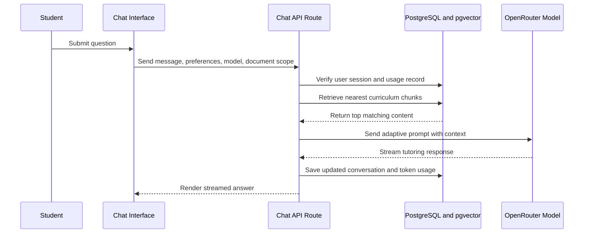

CHAPTER FOUR
SYSTEM IMPLEMENTATION AND DISCUSSION

4.1 IMPLEMENTATION DETAILS

The proposed personalized learning assistant was implemented as a full-stack web application using Next.js 16 with the App Router architecture, TypeScript, React 19, Tailwind CSS, Prisma ORM, Neon PostgreSQL, Better Auth, OpenRouter, and the Vercel AI SDK. The implementation translated the design presented in Chapter Three into an operational tutoring platform that could authenticate users, ingest curriculum materials, retrieve semantically relevant learning content, and deliver adaptive AI responses through a chat interface.

The implementation environment is summarized in Table 4.1.

Table 4.1: Implementation environment and major tools

| Component | Implemented technology | Role in the system |
| --- | --- | --- |
| Frontend framework | Next.js 16 and React 19 | Route-based web interface and server/client rendering |
| Programming language | TypeScript 5 | Type-safe full-stack development |
| Styling layer | Tailwind CSS 4 | Responsive interface styling |
| Authentication | Better Auth | Registration, login, sessions, and route protection |
| Database | Neon PostgreSQL with pgvector | Persistent storage for users, documents, embeddings, usage, and conversations |
| ORM and data access | Prisma 5 with Neon adapter | Database modeling and structured queries |
| Embedding pipeline | OpenRouter embeddings endpoint | Vector generation for uploaded content and search queries |
| Text generation | OpenRouter models via Vercel AI SDK | Streaming AI tutoring responses |
| Document parsing | pdf-parse | Text extraction from uploaded PDF materials |

The implementation followed a modular organization. Database models were defined in the Prisma schema, server behavior was handled through route handlers and server actions, and the user-facing features were implemented through route-specific pages and reusable components. This structure supported the requirement that the system remain curriculum-grounded, student-specific, and deployable through a modern web stack.

In instructional terms, the implementation also reflected several recommendations from recent AI tutoring literature. El Hajji et al. (2025) emphasized adaptive and context-aware educational support, while Wang et al. (2024) highlighted the value of assistance that is responsive to learning context rather than purely generic output. To reflect these positions, the implemented platform treated uploaded curriculum as the primary knowledge source and injected retrieved content directly into the tutoring prompt before response generation.

4.2 PRESENTATION OF IMPLEMENTED FEATURES

The completed implementation addressed all Minimum Usable System requirements identified in the project requirements document, while some advanced personalization capabilities remained intentionally deferred. Table 4.2 summarizes the functional status of the major project requirements.

Table 4.2: Functional implementation status of the system

| Requirement ID | Feature | Implementation status | Evidence from the system |
| --- | --- | --- | --- |
| FR-001 | Authentication and user sessions | Implemented | Better Auth configuration, session tables, protected middleware, login and registration pages |
| FR-002 | Dashboard and progress overview | Implemented | Dashboard page showing greeting, streak, indexed files, and recent materials |
| FR-003 | Curriculum material uploads | Implemented | Drag-and-drop uploader, file validation, PDF/TXT extraction, document persistence |
| FR-004 | RAG document processing pipeline | Implemented | Chunking, embedding generation, pgvector storage, similarity retrieval |
| FR-005 | Adaptive AI chat interface | Implemented | Streaming chat, document filtering, model selection, source-aware prompt construction |
| FR-006 | Topic mastery tracking engine | Not fully implemented | Replaced by lightweight usage-based experience adaptation in the current version |
| FR-007 | Advanced analytics | Partially implemented | Basic activity analytics implemented; advanced mastery graphs remain future work |

The authentication subsystem was implemented through Better Auth and Prisma-backed session management. Middleware checked session availability and redirected unauthenticated users away from protected routes such as the dashboard and chat pages. This ensured that uploaded curriculum materials, conversations, and usage statistics remained tied to the correct user account.

The upload and knowledge-ingestion subsystem accepted PDF and TXT files, enforced a 10 MB upload limit, extracted raw text, and created a document record in the database. The indexing pipeline then divided the text into overlapping chunks of 1000 characters with 200-character overlap, generated embeddings in batches of 50, and stored them in the `DocumentEmbedding` table using pgvector. This provided the semantic basis for curriculum retrieval.

The tutoring subsystem was implemented through a chat route that performed four steps during each request:

1. Validate the authenticated session and enforce usage limits.
2. Extract the latest user message and retrieve the top five closest curriculum chunks.
3. Build an adaptive tutoring prompt using the retrieved context, user preferences, and estimated experience level.
4. Stream the generated response back to the chat interface and persist the updated conversation history.

Figure 4.1 illustrates the implemented response-generation sequence.

Figure 4.1: Runtime interaction sequence for an AI tutoring request

The adaptive behavior of the system was implemented pragmatically. Socratic mode and strict curriculum mode were exposed as user-controlled settings stored in local browser storage and transmitted to the chat endpoint. Experience level was inferred from the number of prior API calls and categorized into three bands: new, intermediate, and experienced. New users received more step-by-step, confidence-building explanations, while experienced users received denser and more technical responses. Although this was not a full mastery-tracking engine, it still created differentiated tutoring behavior using the available implementation scope.

The user interface further operationalized the system requirements. The dashboard acted as the entry point for learning activity, the library handled uploads and document review, the chat page enabled model choice and contextual tutoring, the analytics page summarized activity trends and usage counts, and the settings page supported profile updates, tutor preference toggles, and data deletion controls. This interface structure made the platform functionally complete as a personalized tutoring prototype rather than a single isolated chatbot screen.

4.3 SYSTEM VERIFICATION AND OPERATIONAL RESULTS

System verification was carried out through static code checks and direct inspection of the implemented features on 18 March 2026. Two verification commands were executed: `npx tsc --noEmit` and `pnpm lint`. The results are presented in Table 4.3.

Table 4.3: Verification outcomes for the implemented system on 18 March 2026

| Verification activity | Outcome | Interpretation |
| --- | --- | --- |
| TypeScript compilation (`npx tsc --noEmit`) | Passed | Core TypeScript definitions were internally consistent at the time of review |
| ESLint validation (`pnpm lint`) | Failed | The codebase still contained quality and standards violations requiring cleanup before final production hardening |

Although the TypeScript compilation succeeded, the lint process reported 25 errors and 5 warnings. The reported issues fell into a small number of recurring categories:

Table 4.4: Summary of observed lint findings

| Category of issue | Observed pattern | Practical implication |
| --- | --- | --- |
| Explicit `any` usage | Several API and service files used untyped values | Reduces maintainability and type safety in critical logic |
| React purity warnings | A `Date.now()` call and a synchronous state update in an effect were flagged | Indicates render-time or lifecycle patterns that should be refined |
| Unescaped characters in JSX | Apostrophes in page content triggered formatting lint errors | Minor presentation issue with low functional risk |
| Unused variables | Some temporary variables were declared but not used | Low-risk cleanliness issue |
| Suppression comment quality | `@ts-ignore` was used where stricter suppression was preferred | Signals technical debt in type handling |

These results showed that the application had reached a functional prototype state but had not yet completed its final quality-polishing phase. From a research perspective, this distinction is important: the platform successfully implemented its major educational workflow, but some engineering refinements remained necessary before the system could be described as fully production-ready.

Beyond static verification, the implemented modules demonstrated the following operational outcomes:

Table 4.5: Observable operational outcomes of the implemented prototype

| Module | Observable outcome |
| --- | --- |
| Authentication | Users could access protected learning pages only after valid session checks |
| Document library | Users could upload PDF or TXT materials and see them listed as indexed files |
| Retrieval pipeline | Uploaded materials were chunked, embedded, and made available for context search |
| AI tutoring | Users could submit prompts, receive streamed responses, and continue prior conversations |
| Analytics | Users could view counts for questions asked, chat sessions, and indexed materials |
| Usage governance | Daily API call and monthly token usage thresholds were enforced through stored counters |

The implementation also exposed several bounded design choices. The system supported PDF and TXT formats only, used top-five chunk retrieval, and depended on cloud-based model access through OpenRouter. In addition, the analytics page currently measured activity rather than true concept mastery. These design constraints were acceptable for the implemented scope, but they also marked clear boundaries around the present results.

4.4 DISCUSSION

The implemented system demonstrated that a personalized learning assistant could be operationalized as a curriculum-grounded web platform using modern LLM infrastructure and conventional software engineering tools. In relation to the study objective, the system succeeded in combining user authentication, educational document ingestion, semantic retrieval, adaptive tutoring prompts, and learner-facing dashboards into one coherent application. This placed the work in line with contemporary educational AI efforts that prioritize contextual assistance and scalable personalized support (El Hajji et al., 2025; LearnLM Team, 2025).

One important strength of the implementation was its explicit control of tutoring boundaries. Rather than allowing unrestricted responses, the system offered strict curriculum mode, source-aware prompting, and document-scoped retrieval. This was significant because Qadir and Mumtaz (2025) argued that AI tutors can distort trust when learners are not able to judge whether a system is truly grounded in reliable knowledge. By forcing the assistant to identify its source basis and optionally refuse unsupported questions, the implementation addressed this concern more directly than many generic chat interfaces.

Another strength was the practical treatment of personalization. The system did not yet include full cognitive diagnosis or mastery tracing, but it still individualized behavior through user preferences, stored activity, document selection, and conversation persistence. This resembles a lightweight implementation strategy in which pedagogical control is achieved through structured prompts and curated context rather than expensive model retraining, a direction also reflected in recent tutoring system reports (Wang et al., 2024; El Hajji et al., 2025).

However, the discussion must also recognize the limits of the current implementation. First, the adaptive learner model remained shallow because experience level was inferred from usage frequency rather than direct measures of understanding. Second, the project did not conduct a controlled user study, so it could not claim measurable learning gains comparable to those reported in experimental studies such as LearnLM Team (2025). Third, the verification results showed that while the prototype was functional, code-quality issues remained unresolved in the lint stage. Finally, the analytics module focused on activity indicators rather than validated learning outcomes.

Taken together, the results suggest that the system achieved its software implementation objective and established a credible foundation for a richer personalized tutoring platform. It aligned well with historical ITS principles of combining interface design, domain knowledge, tutoring logic, and learner modeling (Alkhatlan and Kalita, 2018), while adapting those principles to a present-day RAG and LLM workflow. At the same time, the implementation remained appropriately transparent about what had been completed, what had been simplified, and what still required empirical and technical refinement.
